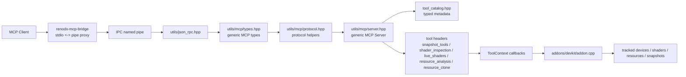
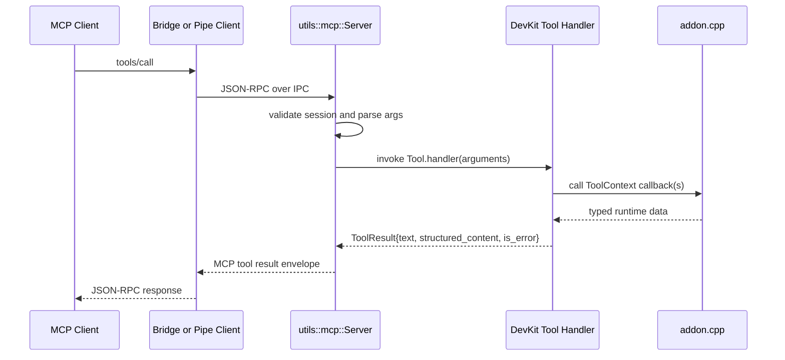

# DevKit MCP Structure

This folder contains the RenoDX DevKit MCP tool surface.

The design is intentionally split into layers:

- `src/utils/json_rpc.hpp`: JSON-RPC framing and parsing
- `src/utils/ipc/ipc.hpp`: named-pipe transport
- `src/utils/mcp/mcp.hpp`: umbrella include for generic MCP
- `src/utils/mcp/types.hpp`: generic MCP wire/model types
- `src/utils/mcp/protocol.hpp`: generic MCP protocol constants and tool-result envelope helpers
- `src/utils/mcp/server.hpp`: generic MCP server runtime
- `src/addons/devkit/mcp/runtime.hpp`: DevKit MCP wiring helpers for tool registration
- `src/addons/devkit/mcp/*.hpp`: DevKit tool metadata, argument parsing, and per-tool handlers
- `src/addons/devkit/addon.cpp`: actual runtime wiring to tracked devices, resources, shaders, and snapshot state

## Architecture

## Data Model

The main rule is:

- typed C++ inside
- `json` at the protocol boundary

That means:

- `InputSchema`, `InputSchemaProperty`, `ToolAnnotations`, `ToolMetadata`, `ToolDescriptor`, and `ToolResult` are typed C++ structures in [`types.hpp`](/C:/Mods/renodx/src/utils/mcp/types.hpp)
- [`tool_catalog.hpp`](/C:/Mods/renodx/src/addons/devkit/mcp/tool_catalog.hpp) only provides the static DevKit metadata table
- conversion to wire JSON happens through `to_json(...)` only when MCP descriptors or payloads are emitted

`ToolResult` is the main boundary parcel:

- `text`: human-readable result text
- `structured_content`: machine-readable JSON payload
- `is_error`: MCP tool failure flag

This keeps tool definitions readable without building large raw JSON blobs by hand.

## Folder Roles

| File | Role |
| --- | --- |
| [`runtime.hpp`](/C:/Mods/renodx/src/addons/devkit/mcp/runtime.hpp) | DevKit MCP registration helpers that map tool names and handlers onto the generic MCP server. |
| [`tool_catalog.hpp`](/C:/Mods/renodx/src/addons/devkit/mcp/tool_catalog.hpp) | Static DevKit metadata table built from the generic MCP metadata types. |
| [`device_selection.hpp`](/C:/Mods/renodx/src/addons/devkit/mcp/device_selection.hpp) | DevKit-specific device index resolution against the currently tracked device list. |
| [`snapshot_summary.hpp`](/C:/Mods/renodx/src/addons/devkit/mcp/snapshot_summary.hpp) | Typed MCP parcel for per-device snapshot-cache summaries. |
| [`shader_hash.hpp`](/C:/Mods/renodx/src/addons/devkit/mcp/shader_hash.hpp) | Shader hash parsing for shader-inspection and live-shader tools. |
| [`resource_handle.hpp`](/C:/Mods/renodx/src/addons/devkit/mcp/resource_handle.hpp) | Resource-handle parsing for resource-clone and resource-analysis tools. |
| [`snapshot_tools.hpp`](/C:/Mods/renodx/src/addons/devkit/mcp/snapshot_tools.hpp) | Snapshot/status/list/select tool handlers over a callback context. |
| [`shader_inspection.hpp`](/C:/Mods/renodx/src/addons/devkit/mcp/shader_inspection.hpp) | Shader summary/disassembly/decompilation tool handlers. |
| [`live_shaders.hpp`](/C:/Mods/renodx/src/addons/devkit/mcp/live_shaders.hpp) | Dump/load/unload live shader tool handlers. |
| [`resource_analysis.hpp`](/C:/Mods/renodx/src/addons/devkit/mcp/resource_analysis.hpp) | Resource readback, preview, and EXR/PNG dump handlers. |
| [`resource_clone.hpp`](/C:/Mods/renodx/src/addons/devkit/mcp/resource_clone.hpp) | Clone hotswap toggle tool handler. |

## Runtime Flow

## Practical Notes

- The bridge advertises the DevKit tool surface up front and auto-connects when exactly one backend pipe is available.
- Snapshot-backed inspection tools stay empty until a frame snapshot is queued and captured with `devkit_queue_snapshot`.
- `devkit_set_tools_path` should usually point at the repo `bin` directory when a game ships conflicting shader tool binaries.
- Shader decompilation is best-effort. Disassembly is generally available first; decompilation may still be unavailable for some older DirectX shader formats.

## Why `ToolContext` Exists

The tool headers do not own DevKit runtime state.

Instead, each tool group defines a `ToolContext` of callbacks. That keeps the headers:

- reusable
- testable in isolation
- independent from the large `addon.cpp` state model

`addon.cpp` is the composition root. It builds the larger snapshot context in `BuildSnapshotToolsContext()`
and the narrower per-tool contexts in `RegisterDevkitMcpTools()`, then passes those into the registration call in
[`runtime.hpp`](/C:/Mods/renodx/src/addons/devkit/mcp/runtime.hpp).

## Why `tool_catalog.hpp` Uses `std::map`

The tool catalog is metadata, not a hot runtime lookup table.

`std::map` is used there because:

- deterministic ordering is useful for stable MCP `tools/list` output
- the catalog is small
- lookup cost is irrelevant at this size

By contrast, the generic MCP server uses `std::unordered_map` for runtime registries like tool handlers and session state.

## Adding a New Tool

1. Add metadata in [`tool_catalog.hpp`](/C:/Mods/renodx/src/addons/devkit/mcp/tool_catalog.hpp).
2. Add or extend a handler header in this folder.
3. Add any needed callback(s) to the relevant `ToolContext`.
4. Implement those callbacks in [`addon.cpp`](/C:/Mods/renodx/src/addons/devkit/addon.cpp).
5. Add the tool-name registration in [`runtime.hpp`](/C:/Mods/renodx/src/addons/devkit/mcp/runtime.hpp) and wire its concrete `ToolContext` callback(s) in `RegisterDevkitMcpTools()` in [`addon.cpp`](/C:/Mods/renodx/src/addons/devkit/addon.cpp).

Keep the split consistent:

- parsing and handler policy in `src/addons/devkit/mcp/*.hpp`
- runtime state access in `addon.cpp`
- protocol transport logic in `src/utils/*`
